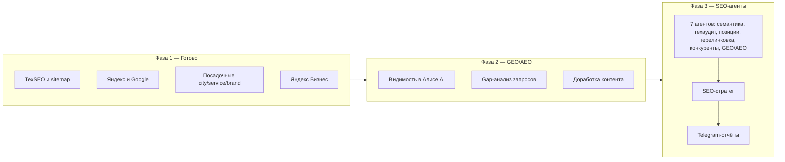

# Мастер-план SEO для rem-phone.ru

## Контекст

Сайт живой: главная, [services](https://rem-phone.ru/services/), [brands](https://rem-phone.ru/brands/), [cities](https://rem-phone.ru/cities/), FAQ. Базовый технический и контентный фундамент уже закрыт: sitemap работает (37 URL), подключены Яндекс.Вебмастер, Google Search Console и Метрика с целями, разметка LocalBusiness/FAQPage на месте, собрана первичная семантика, усилены страницы городов и брендов (включая новые samsung-screen, xiaomi-screen, Honor, Huawei).

Фокус рынка: **Хабаровск, Комсомольск-на-Амуре, Владивосток**, основной канал — **Яндекс**, Google — второй по приоритету.

Следующий этап — не разовые доработки, а два слоя постоянной работы:
1. **GEO/AEO-мониторинг** — присутствие сайта в ИИ-ответах Яндекс.Алисы, отдельный источник трафика вдобавок к классическому SEO.
2. **Система из 7 SEO-агентов** — автоматизация рутины (семантика, техаудит, позиции, перелинковка, конкуренты, GEO/AEO) с ежедневной и еженедельной Telegram-отчётностью через SEO-стратега.

---

## Фаза 1 — Фундамент (завершено)

- Sitemap.xml починен, robots.txt и каноникалы сверены.
- Яндекс.Вебмастер, Google Search Console, Метрика с целями подключены.
- JSON-LD LocalBusiness + FAQPage + хлебные крошки добавлены.
- Семантика Wordstat собрана, приоритетный список посадочных готов.
- Страницы cities/Хабаровск и 3-5 услуг усилены уникальным текстом.
- Карточка Яндекс Бизнес оформлена (зона, фото, отзывы).
- Скрипты автоматизации: генератор sitemap, health-check CI, шаблон посадочных.
- Шаблон еженедельного SEO-отчёта готов.

Эта фаза — база, на которую опираются следующие два слоя. Без неё GEO/AEO-мониторинг и агенты работать не будут (нет данных для сравнения).

---

## Фаза 2 — GEO/AEO: видимость в ИИ-ответах Яндекса

### Почему это важно

В Яндекс.Вебмастере в разделе «Эффективность» появилась вкладка «Видимость сайта в Алисе AI». Она показывает Share of Voice — присутствие сайта в ИИ-ответах — и разбивку по запросам: где сайт уже участвует в ответе, а где нет (с указанием конкурентов, на чьём контенте строится ответ). Яндекс формирует ИИ-ответы на основе обычной поисковой выдачи, поэтому качественный контент даёт трафик из SEO, GEO и AEO одновременно. Яндекс занимает ~70% поискового трафика в РФ — инструмент закрывает основной объём аудитории.

### Задачи

1. Открыть раздел «Видимость сайта в Алисе AI», проверить доступность Share of Voice для rem-phone.ru.
2. Собрать в `seo/geo-aeo-queries.csv` запросы «с моим сайтом» (база для отслеживания динамики) и запросы без присутствия сайта (пул возможностей).
3. Приоритизировать пул по формуле город + бренд + услуга («ремонт iPhone Хабаровск», «замена экрана Samsung Владивосток»).
4. По каждому приоритетному запросу открыть «Посмотреть в ответе», зафиксировать конкурентов (Pedant.ru, Zoon.ru, ServiceRating.ru, локальные сервисы) и структуру их контента (цены, сроки, гарантии, FAQ, отзывы).
5. Сформировать gap-анализ: запрос → лидеры → чего не хватает на rem-phone.ru → какую страницу доработать или создать.
6. Доработать/создать контент полнее и структурнее конкурентов, используя уже собранную таблицу моделей телефонов по брендам.
7. Усилить ключевые материалы на Дзен, VC.ru, DTF для дополнительного веса в выдаче источников для ИИ-ответа.
8. Раз в неделю фиксировать изменение Share of Voice и список запросов, перешедших из «без сайта» в «с моим сайтом».

### Известные ограничения

- Инструмент работает только с ИИ-ответами Яндекса (Алиса), не покрывает ChatGPT/Gemini — отдельная задача на будущее.
- Для нового/малотрафикового сайта данных может быть недостаточно первые несколько недель — это нормально, повторить сбор позже.

---

## Фаза 3 — Система из 7 SEO-агентов

### Идея

По аналогии с «SEO-машиной» на Claude — 7 узкоспециализированных агентов вместо одного универсального скрипта. Каждый агент со своей зоной ответственности, промптами и доступами; SEO-стратег сверху собирает данные и формирует Telegram-отчётность.

### Состав агентов

| # | Агент | Зона ответственности |
|---|-------|----------------------|
| 1 | Сборщик семантики | Wordstat + Google Keyword Planner, сверка с текущими кластерами, новые/сезонные запросы |
| 2 | Технический аудитор | Скорость, sitemap, robots.txt, JSON-LD, мобильная версия, битые ссылки, дубли title/description |
| 3 | Трекер позиций | Яндекс.Вебмастер + Google Search Console, история позиций день к дню в `seo/positions-history.csv` |
| 4 | Внутренняя перелинковка | Анализ структуры cities/brands/services/FAQ, добавление релевантных внутренних ссылок |
| 5 | Разведка конкурентов | Сравнение позиций и структуры контента с Pedant.ru, Zoon, ServiceRating и локальными сервисами |
| 6 | GEO/AEO мониторинг | Использует данные из Фазы 2 (видимость в Алисе AI) как источник для общего отчёта |
| 7 | SEO-стратег | Собирает выводы агентов 1-6, формирует ежедневный и еженедельный отчёт, отправляет в Telegram |

### Что нужно сделать технически

1. Подключить агентов к Яндекс.Вебмастеру и Google Search Console (API/токены).
2. Создать хранилища данных: `seo/positions-history.csv`, `seo/tech-audit-log.csv`, `seo/competitor-comparison.csv`, `seo/geo-aeo-queries.csv` (из Фазы 2).
3. Задокументировать в `seo-agents-config.md`: промпт и зону ответственности каждого агента, расписание запуска (техаудит — 1 раз/неделю, трекер позиций — ежедневно, стратег — после отработки агентов 1-6), зависимости между агентами.
4. Настроить Telegram-бота/канал для отчётов:
   - **Ежедневно**: позиции (рост/падение), новые ссылки, счётчик срочных/несрочных замечаний.
   - **Еженедельно**: сводка по конкурентам, динамика Share of Voice (GEO/AEO), динамика позиций, топ-приоритеты на следующую неделю.

---

## Критерии готовности (по фазам)

**Фаза 2 (GEO/AEO):**
- Таблица `seo/geo-aeo-queries.csv` создана и обновляется еженедельно.
- Минимум 5 приоритетных запросов проработаны с gap-анализом.
- Контент по первым 3 запросам опубликован/доработан.
- Зафиксирован базовый уровень Share of Voice.

**Фаза 3 (агенты):**
- Все 7 агентов описаны в `seo-agents-config.md`.
- Связка Вебмастер/Search Console → трекер позиций → история работает.
- Первый тестовый ежедневный и еженедельный отчёт успешно приходят в Telegram.
- Данные GEO/AEO-агента корректно попадают в общий отчёт стратега.

---

## Операционный ритм (уже используется)

- `seo/AGENT_RITUAL.md` — еженедельный порядок работы.
- `node seo/weekly-run.mjs` — health-check + отчёт.
- `node seo/audit-monthly.mjs` — месячный noindex/Wordstat-чеклист.
- `seo/LEAD_PIPELINE.md` — пайплайн заявок (Render + Worker).

## Вне скоупа

- Покупные ссылки, накрутка поведенческих факторов.
- Массовый автоген сотен страниц без уникального контента.
- Полная смена дизайна «ради красоты» без гипотезы конверсии.
- Отдельное мобильное приложение / тяжёлая CRM (пока нет объёма заявок).
- Мониторинг ИИ-ответов вне Яндекса (ChatGPT, Gemini) — отдельная будущая задача.
</content>